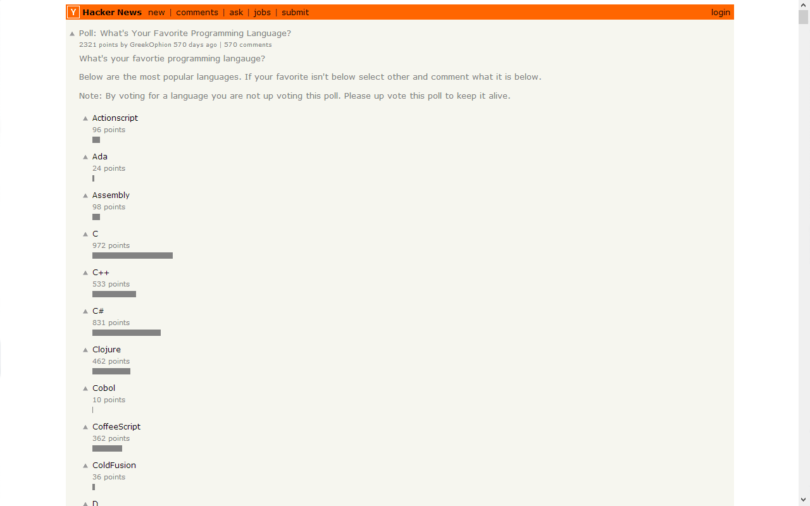

Bar Charts for Hacker News Polls
================================

*Bar Charts for Hacker News Polls* (hnpoll) is a Google Chrome extension that automatically
generates bar charts for Hacker News (HN) polls.

It is available from the Google Chrome Web Store:
https://chrome.google.com/webstore/detail/bar-charts-for-hacker-new/dpdhhdidaaippolkbadpdhlffnpnjimd

To use hnpoll, install the extension, and it will work automatically on relevant HN pages.

Screenshot
----------

The following image shows the links produced by HNDD on a duplicate HN submission page.

License
-------

See [LICENSE](LICENSE).
